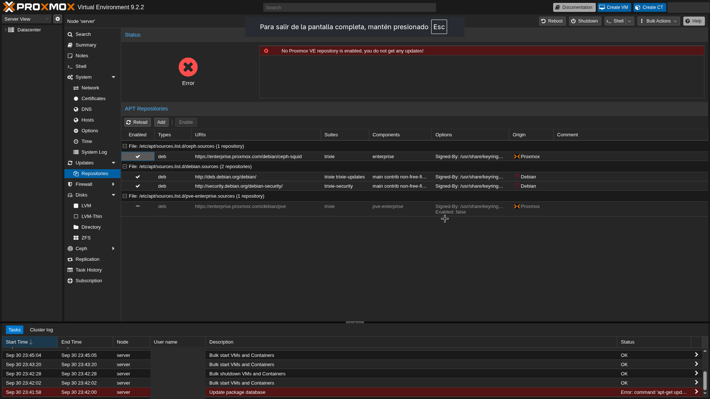
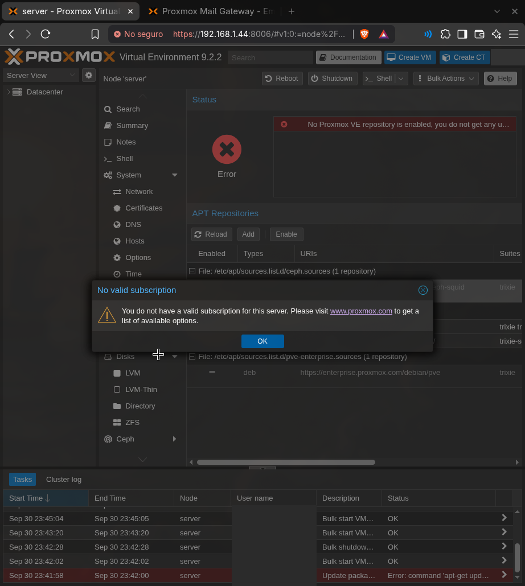

# 1. Instalación y post-instalación de Proxmox

## Instalación

Proxmox VE 9.2 instalado en el SSD del ThinkCentre con **ext4** (no ZFS: con 4 GB de RAM, ZFS consume demasiada memoria para su caché).

## Repositorios

Proxmox es software libre (AGPLv3). La suscripción solo da acceso al repositorio `enterprise` y a soporte, así que sin ella hay que cambiar de repositorio o no llegan actualizaciones.

En **Node → Updates → Repositories**:

1. Deshabilitar `pve-enterprise` y `ceph ... enterprise`.
2. Añadir **No-Subscription**.



Al añadir el repositorio aparece el aviso "No valid subscription". Es solo informativo, no limita nada.



Equivalente por terminal (Proxmox 9 usa archivos `.sources` en formato deb822):

```sh
sed -i 's/^Types:/Enabled: no\nTypes:/' /etc/apt/sources.list.d/pve-enterprise.sources /etc/apt/sources.list.d/ceph.sources
cat > /etc/apt/sources.list.d/proxmox.sources <<'EOF'
Types: deb
URIs: http://download.proxmox.com/debian/pve
Suites: trixie
Components: pve-no-subscription
Signed-By: /usr/share/keyrings/proxmox-archive-keyring.gpg
EOF
apt update && apt full-upgrade -y
```

## Actualización

**Updates → Refresh → Upgrade**, y reinicio para cargar el kernel nuevo.
