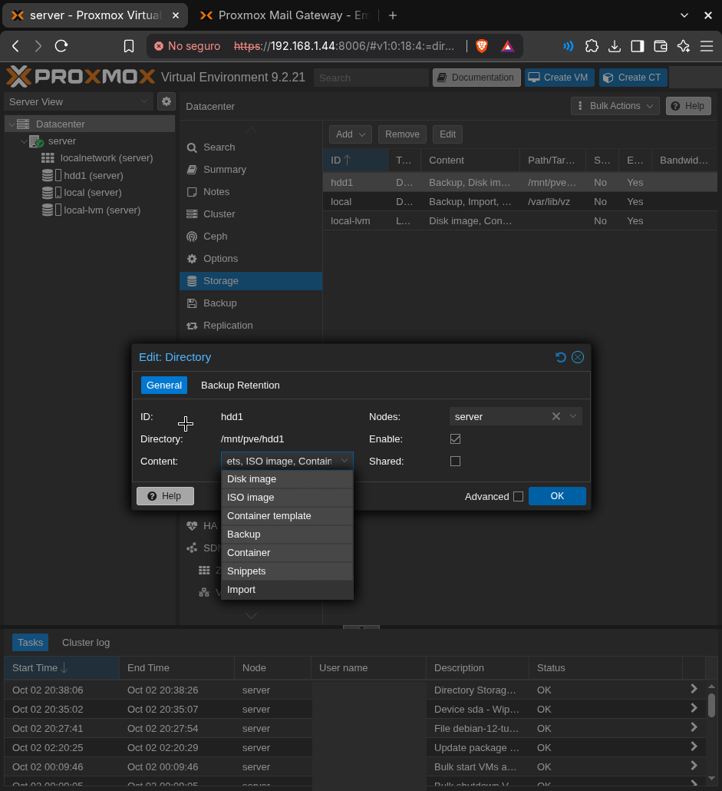

# 2. Almacenamiento: HDD de datos

## Diseño

- **SSD (256 GB):** Proxmox y los discos de sistema de los contenedores. Ahí van el sistema, las bases de datos y la interfaz, que necesitan disco rápido.
- **HDD (1 TB):** archivos de usuario y backups. Ahí lo que importa es el espacio, no la velocidad.

## Preparar el HDD

1. **Disks** → seleccionar el HDD → **Wipe Disk** (comprobando antes que es el de 1 TB y no el SSD).
2. **Disks → Directory → Create**: filesystem `ext4`, nombre `hdd1`, *Add Storage* ✔.
3. **Datacenter → Storage → hdd1 → Edit → Content**: `Disk image`, `Container`, `Backup`.

## Nombres

El almacenamiento se llama `hdd1` para dejar espacio a futuros discos (`hdd2`, `backup1`…). El ID de un storage no se puede renombrar fácilmente, porque las VMs y CTs lo guardan en su configuración.

## Plan a futuro

`hdd1` se usa ahora tanto para la nube como para los backups. Con un segundo disco:

- **Disco nuevo para backups** (`backup1`): quitar `Backup` del Content de `hdd1` y apuntar el job de backup a `backup1`.
- **Disco nuevo para la nube**: mover el mount point con **Resources → Volume Action → Move Storage**.
