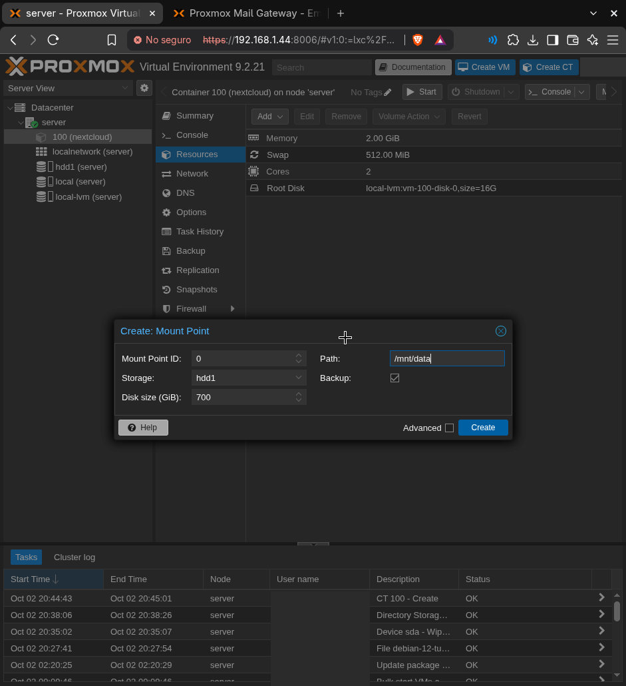
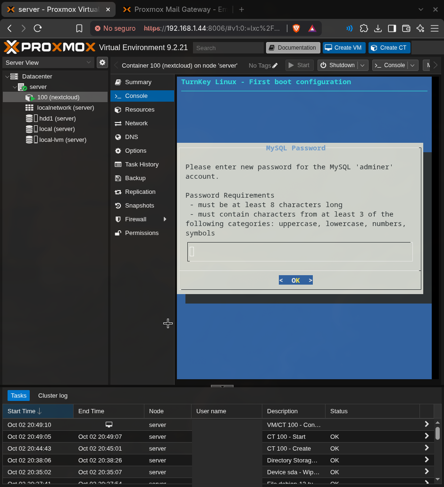
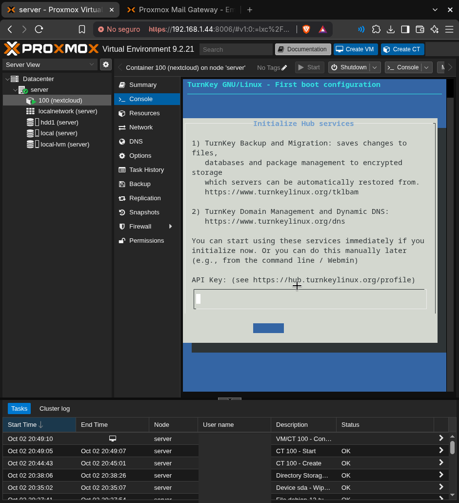
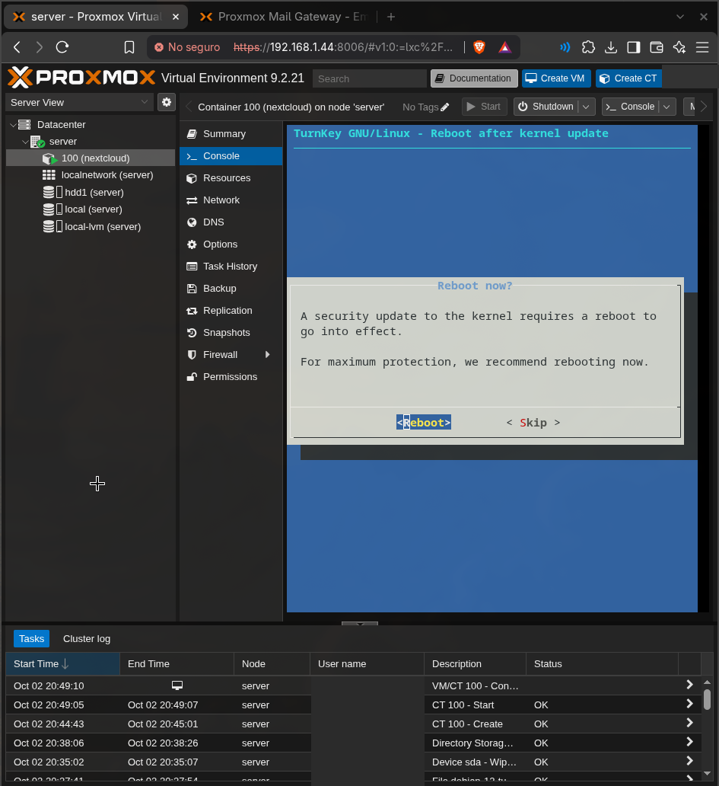
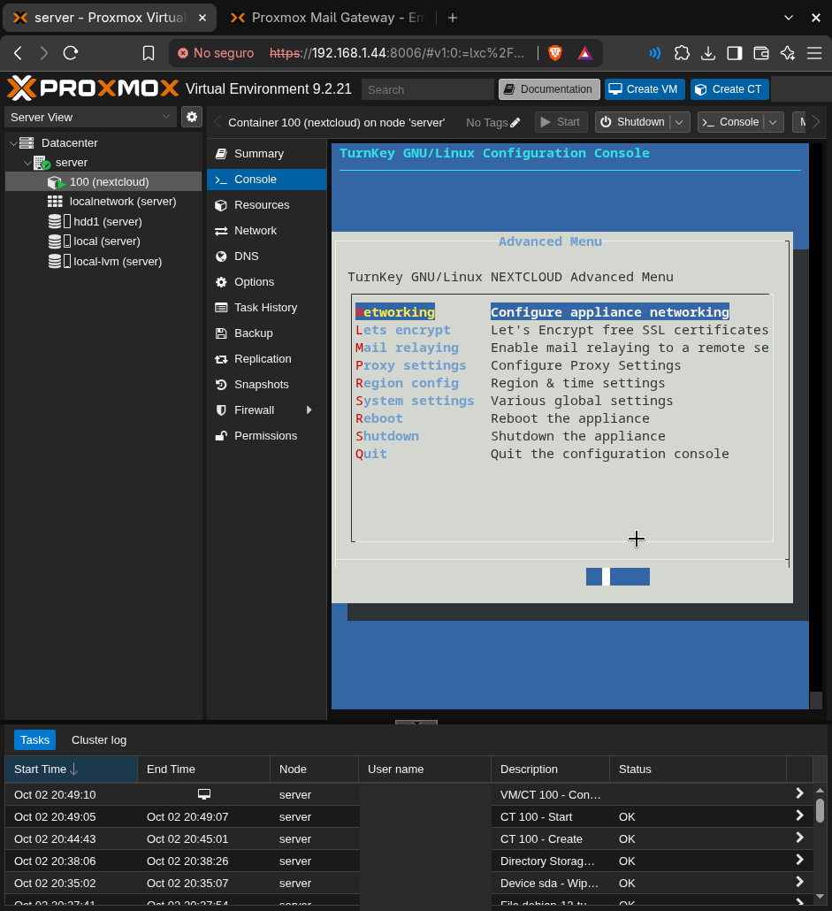
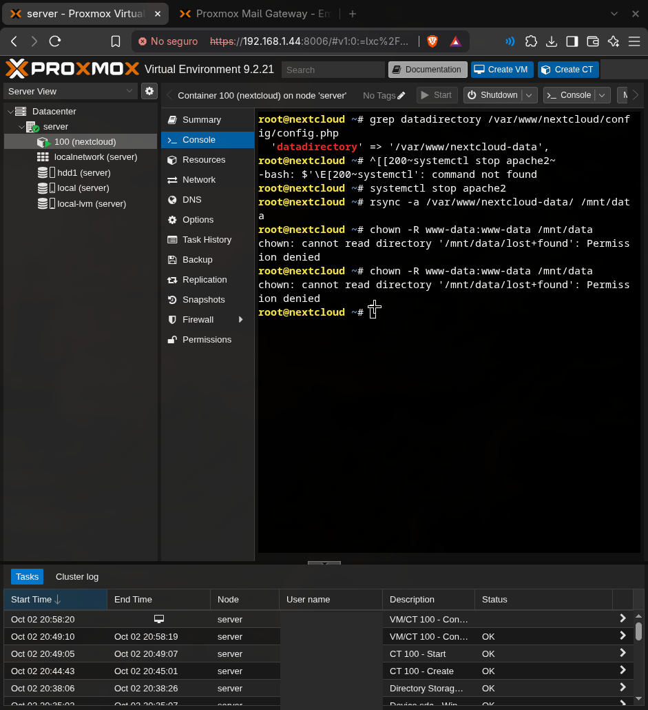

# 3. Nextcloud en contenedor LXC

## ¿Por qué LXC y TurnKey?

- **LXC en vez de VM:** comparte el kernel del host, así que usa mucha menos RAM. Con 4 GB es la única opción razonable.
- **Plantilla TurnKey Nextcloud:** viene en el catálogo de plantillas de Proxmox, con Nextcloud, la base de datos y Apache ya configurados.
- **Contenedor unprivileged:** el root del contenedor no es root en el host, lo que reduce el impacto de una posible fuga del contenedor.

## Crear el contenedor

Plantilla: **local → CT Templates → Templates → turnkey-nextcloud**.

| Parámetro | Valor |
|---|---|
| CT ID | 100 |
| Unprivileged | ✔ |
| Nesting | ✔ |
| Root disk | `local-lvm`, 16 GB (SSD) |
| CPU | 2 cores |
| RAM / Swap | 2048 MB / 512 MB |
| Red | `vmbr0`, IP estática en la LAN |

## Disco de datos (mount point)

Antes del primer arranque: **Resources → Add → Mount Point** en `hdd1`, 700 GB, ruta `/mnt/data`.

La casilla **Backup** del mount point quedó **desmarcada**: si estuviera marcada, cada backup copiaría los 700 GB al mismo HDD, que no tiene sitio para eso.



## Configuración inicial (TurnKey)

En la consola del CT arranca un asistente:

- Contraseña de **Adminer** (panel web de la base de datos) y del administrador de Nextcloud.
- **Hub services** (backup en la nube y DNS de TurnKey): *Skip*.
- **Email** de notificaciones: *Skip*.
- **Security updates**: *Install*.




Tras las actualizaciones pide reiniciar por el kernel. **No hace falta:** un LXC usa el kernel del host, así que reiniciar el contenedor no cambia nada. El kernel se actualiza actualizando y reiniciando Proxmox.



Al final queda el menú de TurnKey (`confconsole`). Con *Quit* se vuelve a la terminal.



## Mover los datos al HDD

TurnKey guarda los datos en `/var/www/nextcloud-data`, que está en el SSD. Para moverlos al HDD:

```sh
grep datadirectory /var/www/nextcloud/config/config.php   # ruta actual
systemctl stop apache2
rsync -a /var/www/nextcloud-data/ /mnt/data/
chown -R www-data:www-data /mnt/data
sed -i "s|'datadirectory' => '.*'|'datadirectory' => '/mnt/data'|" /var/www/nextcloud/config/config.php
chmod 770 /mnt/data
systemctl start apache2
grep datadirectory /var/www/nextcloud/config/config.php   # debe decir /mnt/data
```



**Error esperado:** `chown: cannot read directory '/mnt/data/lost+found': Permission denied`. `lost+found` pertenece al root del host, y en un CT unprivileged no se puede tocar. No afecta a Nextcloud.

**Al pegar en la consola web:** a veces se cuelan caracteres de *bracketed paste* (`^[[200~`). Pegando línea por línea se evita.

## Verificación

1. Login web en `https://<IP-del-CT>`.
2. Subir un archivo de prueba.
3. Comprobar que aparece en el HDD con `ls /mnt/data/<usuario>/files`.
