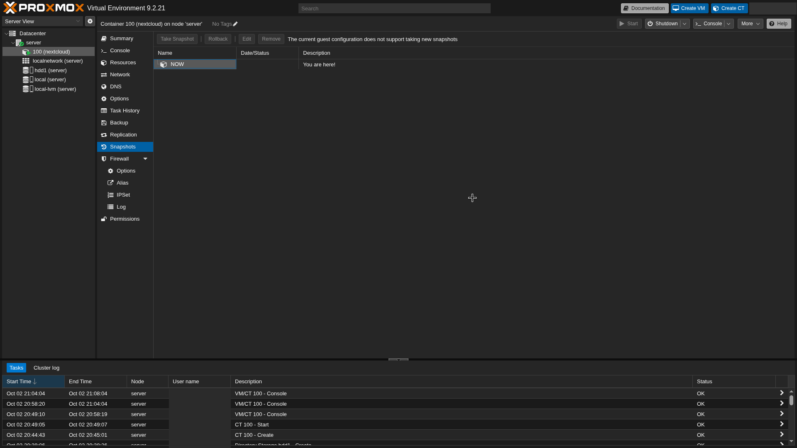

# 4. Backups

## Snapshots: no disponibles

> The current guest configuration does not support taking new snapshots

Proxmox solo hace snapshots de un CT si **todos** sus volúmenes están en un almacenamiento que los soporte. El rootfs está en `local-lvm` (LVM-thin, sí los soporta), pero el mount point está en `hdd1`, que es de tipo **Directory** (no los soporta).

**Decisión:** usar backups vzdump en lugar de snapshots. Para tener snapshots habría que rehacer `hdd1` como LVM-Thin, borrando el disco.

## Backup manual

**CT 100 → Backup → Backup now**: storage `hdd1`, mode `Snapshot` (sin apagar el CT), compresión `ZSTD`.

## Backup programado

**Datacenter → Backup → Add**:

| Campo | Valor |
|---|---|
| Storage | `hdd1` |
| Schedule | `sun 03:00` (domingos 3 AM) |
| Selection | All (incluye los CT futuros) |
| Mode | Snapshot |
| Compression | ZSTD |
| Retention | Keep Last 4 (un mes de historial) |

## Qué cubre y qué no

| Riesgo | ¿Cubierto? |
|---|---|
| Una actualización rompe Nextcloud | ✅ Se restaura el rootfs |
| Borrado accidental de archivos | ⚠️ Solo la papelera y el versionado de Nextcloud |
| Fallo del HDD | ❌ Los archivos y los backups están en el mismo disco |

**Pendiente:** un disco `backup1` dedicado, y una copia externa de los archivos (regla 3-2-1).
