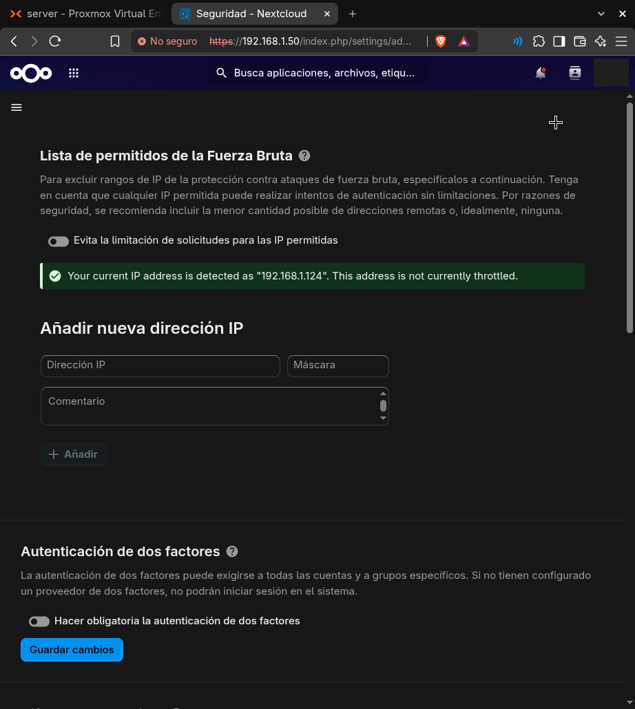
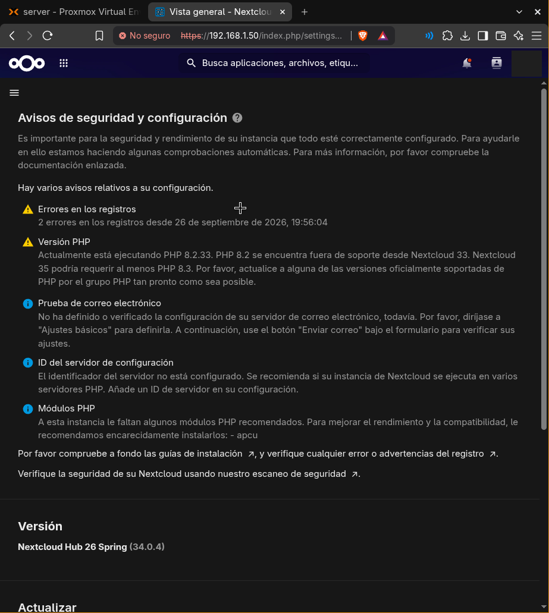

# 5. Endurecimiento de Nextcloud

Objetivo: dejar limpia la lista de avisos de **Administración → Vista general** antes de exponer el servidor a Internet (Fase 6).

Todo se hace en la consola del CT 100 como root. TurnKey **no trae `sudo`**, así que los comandos de Nextcloud (`occ`) se ejecutan con `runuser`:

```sh
OCC="runuser -u www-data -- php /var/www/nextcloud/occ"
$OCC setupchecks   # la misma lista de avisos, desde la terminal
```

> Desde la terminal salen avisos falsos ("remote address could not be determined", "insecure URLs", OPcache), porque no hay ningún navegador haciendo la petición. La lista que cuenta es la de la web.

## Hallazgo principal: Nextcloud desactualizado

La plantilla de TurnKey traía **Nextcloud 29.0.4**, una rama sin parches de seguridad. Nextcloud solo deja subir **una versión mayor cada vez**, así que se encadenaron saltos con el updater oficial:

```sh
runuser -u www-data -- php /var/www/nextcloud/updater/updater.phar   # repetir hasta "No update available"
$OCC app:update --all            # con el modo mantenimiento YA desactivado
$OCC maintenance:mode --off
```

Resultado: **29.0.4 → 29.0.16 → … → 34.0.4**. Antes de empezar se hizo un backup del CT a `hdd1` ([Fase 4](04-backups.md)).

## Integridad del código

`integrity:check-core` marcaba `core/templates/layout.guest.php`. Comparándolo con el original de GitHub para esa misma versión, la única diferencia era el pie de página "Powered by TurnKey Linux" en la pantalla de login. No era malicioso, y el updater lo reemplazó por el original.

```sh
curl -fsSL "https://raw.githubusercontent.com/nextcloud/server/v<versión>/core/templates/layout.guest.php" -o /tmp/orig.php
diff /tmp/orig.php /var/www/nextcloud/core/templates/layout.guest.php
```

## Ajustes aplicados

| Aviso | Solución |
|---|---|
| Ventana de mantenimiento | `config:system:set maintenance_window_start --type=integer --value=1` (tareas pesadas de 01:00 a 07:00 UTC) |
| Región de teléfono | `config:system:set default_phone_region --value="PA"` |
| OPcache casi lleno | `/etc/php/8.2/apache2/conf.d/99-nextcloud-opcache.ini` con `memory_consumption=256`, `interned_strings_buffer=16`, `max_accelerated_files=20000` |
| Índices de la base de datos | `db:add-missing-indices` |
| Migraciones de mimetypes | `maintenance:repair --include-expensive` |
| Falta `apcu` | `apt install php8.2-apcu`, `apc.enable_cli=1` para el cron, `memcache.local` = `\OC\Memcache\APCu` |
| ID del servidor | `config:system:set serverid --type=integer --value=1` |
| AppAPI sin usar | `app:disable app_api` (menos superficie de ataque) |

## Log y carpeta de datos antigua

Al mover los datos al HDD en la [Fase 3](03-nextcloud.md), el log se quedó en la carpeta antigua `/var/www/nextcloud-data` (en el SSD), porque TurnKey fija su ruta en `config.php`. Esa carpeta solo tenía el usuario de ejemplo de TurnKey y una caché vieja.

```sh
install -d -o www-data -g www-data -m 750 /var/log/nextcloud
mv /var/www/nextcloud-data/nextcloud.log /var/log/nextcloud/
$OCC config:system:set logfile --value=/var/log/nextcloud/nextcloud.log
mv /var/www/nextcloud-data /root/nextcloud-data.old   # se borra tras unos días sin problemas
```

Se movió en vez de borrarse para poder deshacerlo si algo fallaba.

## Doble factor (2FA) con TOTP



1. `$OCC app:enable twofactor_totp`
2. **Configuración personal → Seguridad → Habilitar TOTP**: escanear el QR con una app de autenticación (Aegis, 2FAS…) y verificar el código.
3. Generar los **códigos de respaldo** y guardarlos fuera del servidor y del móvil.
4. Cerrar sesión y volver a entrar para probarlo.
5. Solo después: **Administración → Seguridad → Hacer obligatoria la autenticación de dos factores**.

La lista de permitidos de fuerza bruta se deja **vacía**: una IP permitida puede probar contraseñas sin límite. Esa misma página confirma que Nextcloud ve la IP real del cliente, así que la protección contra fuerza bruta funciona.

Si alguien pierde el acceso al segundo factor: `$OCC twofactorauth:disable <usuario> totp` desde la consola. Por eso la contraseña de Proxmox es la llave maestra.

## Estado final



| Aviso restante | Motivo |
|---|---|
| Errores en los registros | Dos errores de la versión 29 (un archivo de `firstrunwizard` que no existía). Desaparecen solos con los días. |
| PHP 8.2 | Debian 12 no tiene PHP 8.3. **Deuda:** migrar a TurnKey/Debian 13 antes de Nextcloud 35. |
| Correo | Pendiente; no afecta a la seguridad. |
