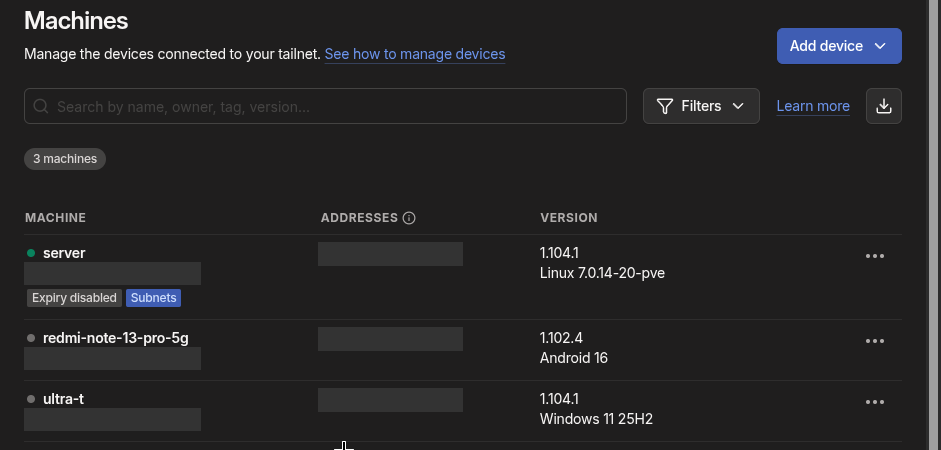

# 6. Acceso remoto con Tailscale

Objetivo: llegar a Nextcloud y a la web de Proxmox desde fuera de casa **sin abrir puertos en el router** ni exponer nada a Internet.

## Diseño

Tailscale se instala **solo en el host Proxmox**, que hace de *subnet router* y anuncia la LAN `192.168.1.0/24` a la red de Tailscale (*tailnet*). Los clientes conectados a Tailscale llegan a las mismas IPs que en casa:

| Servicio | Dirección (igual dentro y fuera de casa) |
|---|---|
| Nextcloud (CT 100) | `https://192.168.1.50` |
| Proxmox | `https://192.168.1.44:8006` |

Como la dirección de Nextcloud no cambia, **no hace falta tocar `trusted_domains`**. Tampoco hace falta instalar Tailscale dentro del CT.

## Host Proxmox

En la Shell del nodo (no del CT 100):

```sh
curl -fsSL https://tailscale.com/install.sh | sh

# Reenvío de paquetes, imprescindible para que el host enrute hacia la LAN
printf 'net.ipv4.ip_forward = 1\nnet.ipv6.conf.all.forwarding = 1\n' > /etc/sysctl.d/99-tailscale.conf
sysctl -p /etc/sysctl.d/99-tailscale.conf

tailscale up --advertise-routes=192.168.1.0/24 --accept-dns=false
```

`--accept-dns=false` evita que Tailscale reescriba el `/etc/resolv.conf` del servidor. El comando muestra una URL para iniciar sesión.

## Consola de administración

En la máquina `server`, menú **⋯**:

- **Edit route settings** → aprobar `192.168.1.0/24`. Sin este paso, la ruta anunciada no se usa.
- **Disable key expiry**. Si no, el servidor se desconecta a los 180 días y no hay nadie delante para volver a iniciar sesión.



## Clientes

- **Móvil Android**: app Tailscale con la misma cuenta. Acepta las rutas de subred por defecto.
- **Portátil Windows**: app Tailscale con la opción *Use Tailscale subnets* activada.
- (Un cliente Linux necesitaría `tailscale up --accept-routes`.)

## Prueba

Desde el móvil, **con el Wi-Fi apagado y usando datos móviles**: `https://192.168.1.50` y `https://192.168.1.44:8006` cargan las dos. ✅

## Limitación conocida

Si el cliente está en otra red que también usa `192.168.1.0/24` (habitual en routers domésticos), las rutas chocan y gana la red local. Solución si llega a pasar: cambiar la subred de casa o usar la IP `100.x` de Tailscale del host.
